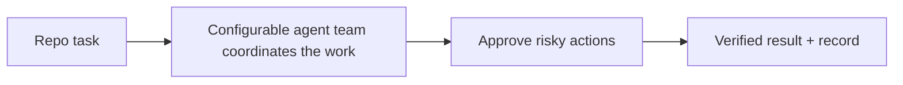

# GistClaw

GistClaw is a local AI team for software projects.

You give it a repo task. It coordinates multiple agents to plan the work, prepare a change, ask before doing anything risky, verify the result, and leave a clear record of what happened.

It is the focused follow-through on what OpenClaw taught us: keep the power, cut the sprawl.

## Why It Matters

- less babysitting
- clearer handoffs
- safer changes
- a calmer system you can actually trust with real repo work

GistClaw narrows OpenClaw into one sharper promise: local-first repo work with approvals, verification, and a clear audit trail.

## How It Works

1. You give GistClaw a repo task.
2. The runtime fans the work out across a configurable agent team.
3. Agents hand work off, share context, and stay inside one run boundary.
4. You approve risky actions before they happen.
5. GistClaw verifies the result and records what happened.



## Multi-Agent Infrastructure

- one local runtime coordinates multiple agents around the same task
- agents share context, boundaries, and the same audit trail
- handoffs stay explicit so the work is easier to inspect
- the runtime cares about capabilities and handoffs, not fixed job titles

## Status

This repository is still in design and planning mode. There is no runnable implementation yet.

## Development

Bootstrap the repo-local developer tools first:

```bash
make dev
make hooks-install
```

Day-to-day workflow:

```bash
make fmt
make lint
make test
make coverage
make run
```

Targets:

- `make dev` bootstraps repo-required developer tools
- `make fmt` runs `goimports -w` over tracked `.go` files
- `make lint` runs `golangci-lint`
- `make test` runs `go test ./...`
- `make coverage` runs the full Go test suite with a repo-wide minimum coverage gate of `70%`
- `make run` starts `./cmd/gistclaw`
- `make hooks-install` runs `lefthook install`

## Contributing

Issues, questions, and focused doc improvements are welcome. The most useful contributions right now are clarity improvements, architecture feedback, and review of the v1 plan.

## Related Project

GistClaw grows out of lessons from [OpenClaw](https://github.com/openclaw/openclaw).

## License

MIT
