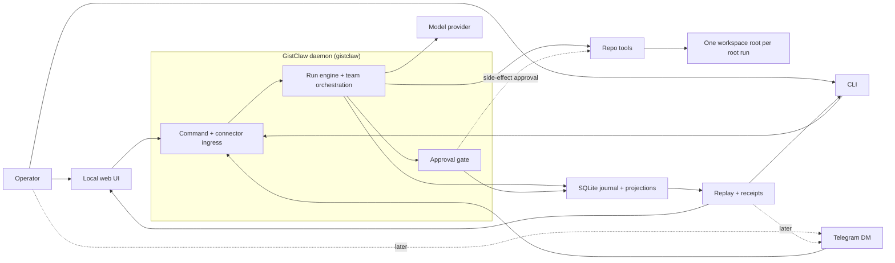
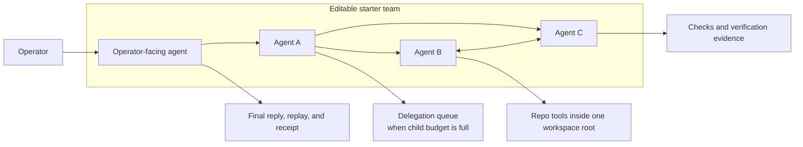
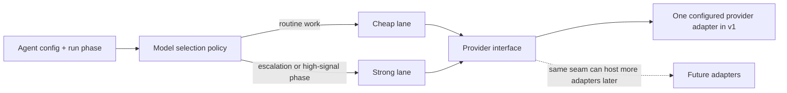
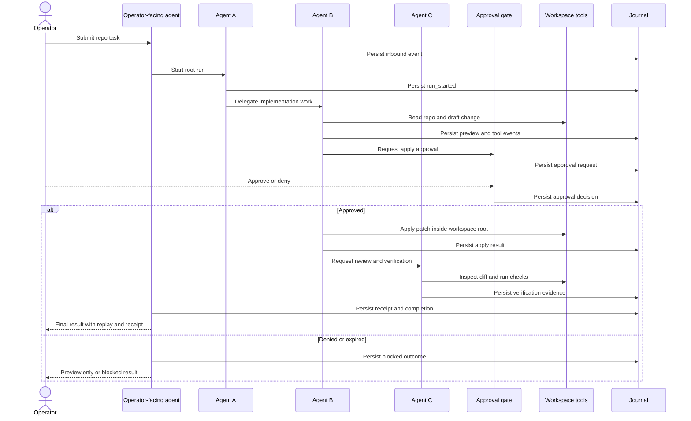
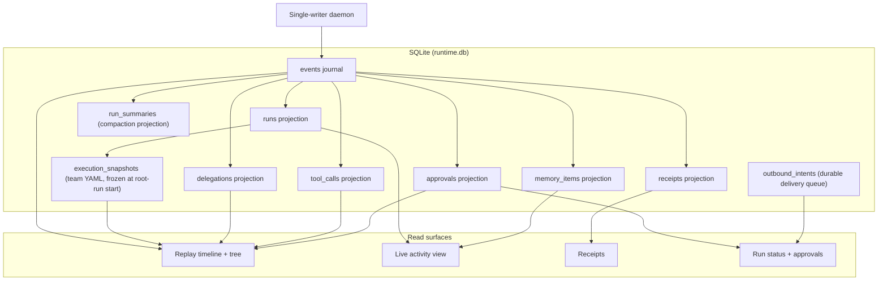
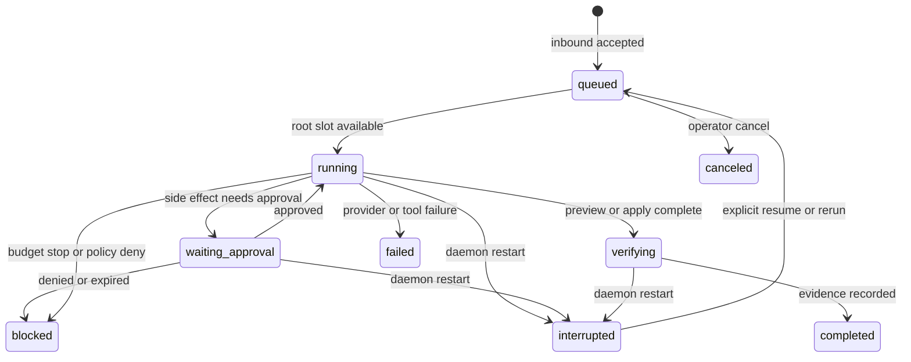

# System Diagrams

Start here if you want to understand GistClaw quickly.

These diagrams are the shortest path to the runtime shape, the work loop, and the trust model.

## 1. System Context

GistClaw is a single-writer local daemon with multiple operator surfaces.
The daemon owns state, orchestration, approvals, and replay.

## 2. Team Topology

GistClaw is not a single agent with internal moods.
It is an explicit team with a configurable agent graph, explicit handoffs, and bounded execution ownership.

Notes:

- v1 ships one editable starter team, not a fixed role catalog as the product identity
- agent names stay operator-defined
- there is one active root run per conversation, with bounded child concurrency under that root
- at least one agent must own workspace-write capability
- at least one agent may be designated operator-facing

## 3. Provider And Model Lanes

GistClaw is multi-agent before it is multi-provider.
The first useful release keeps one configured provider adapter and two explicit lanes.

Notes:

- lane selection is explainable from agent configuration and run phase
- the stronger lane is for escalations, synthesis, verification, and other high-signal phases
- the cheaper lane handles routine work by default
- any escalation to the stronger lane must be visible in replay and receipts

## 4. Runtime Workflow

The core product loop is not "chat with one model."
It is a bounded team workflow that turns a repo task into a reviewed result with an approval checkpoint before side effects.

## 5. Durable Data Model

The journal is the history spine.
Everything the operator trusts later, including replay and receipts, is derived from the same durable event stream.

## 6. Run Lifecycle

The lifecycle is intentionally boring.
There is one active root run per conversation, approvals are explicit, and restarts produce `interrupted` instead of magical recovery.

## What to read next

- `19-buildable-v1-plan.md` for the first shippable product loop
- `20-v1-implementation-backlog.md` for the concrete build order
- `11-architecture-redesign.md` for the full architectural stance
